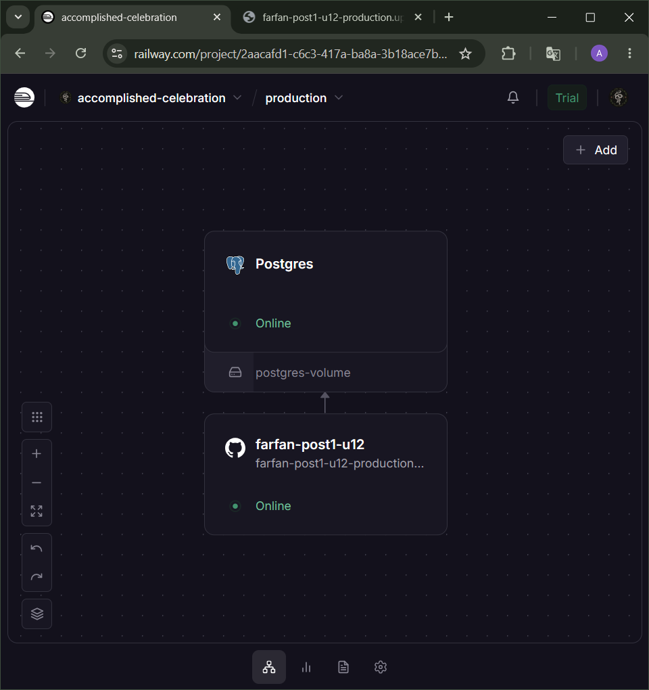
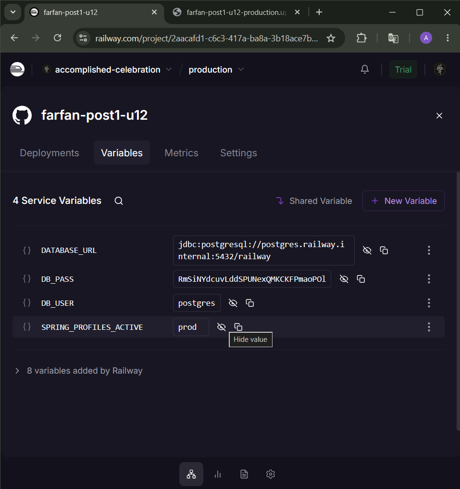
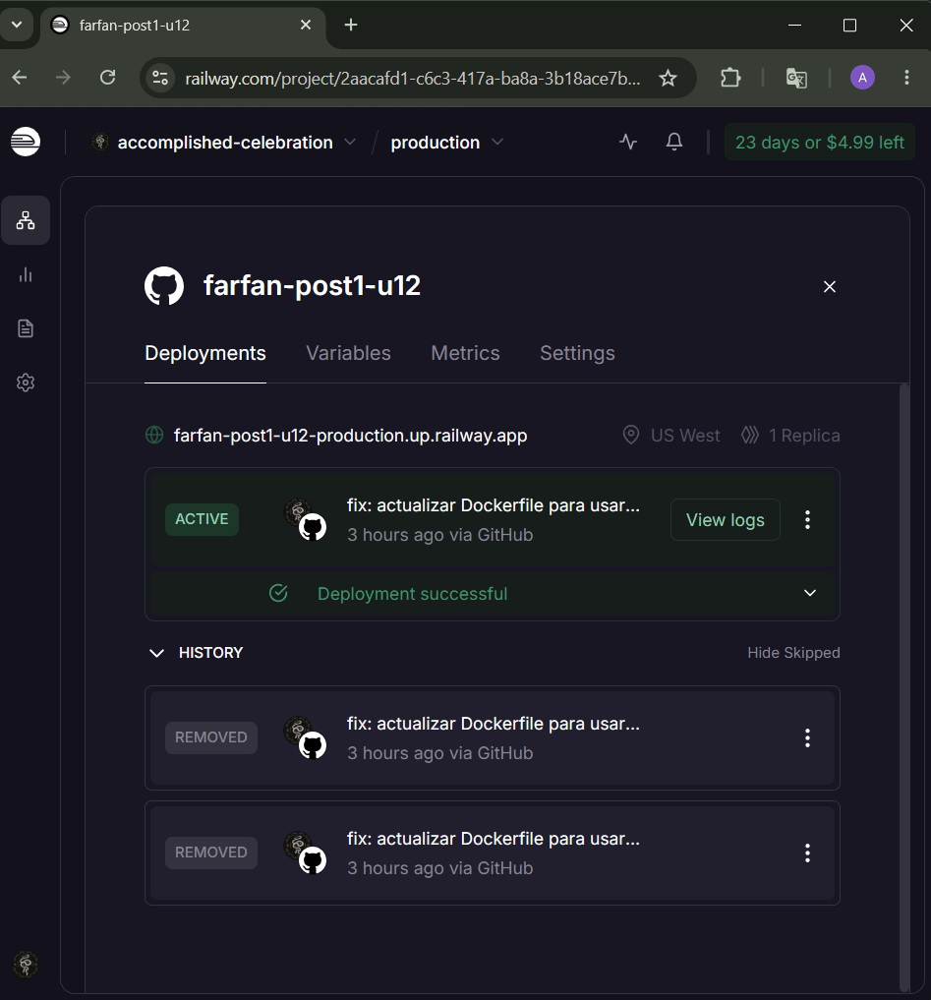
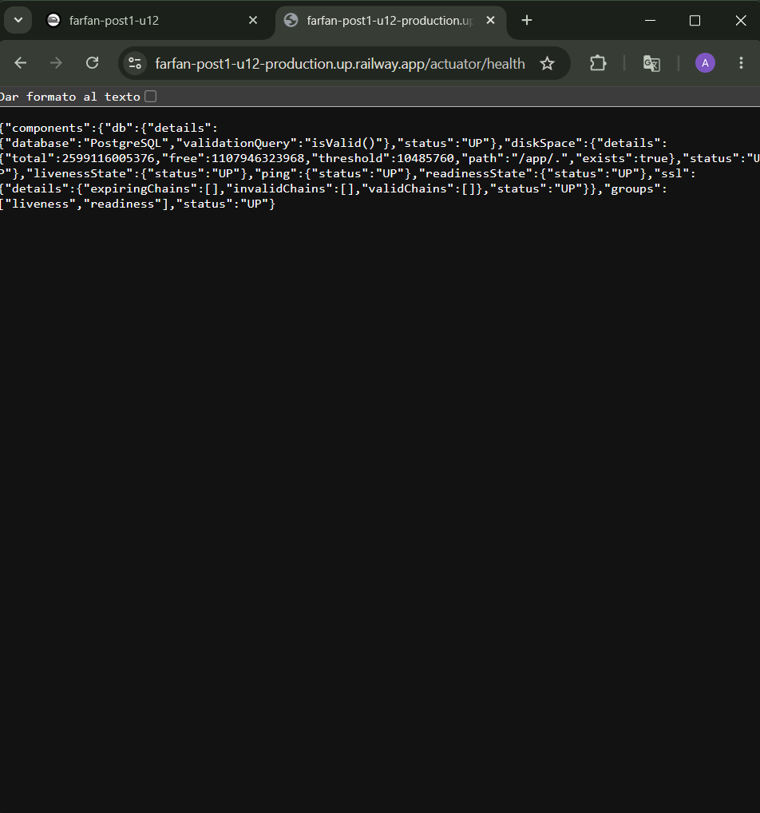
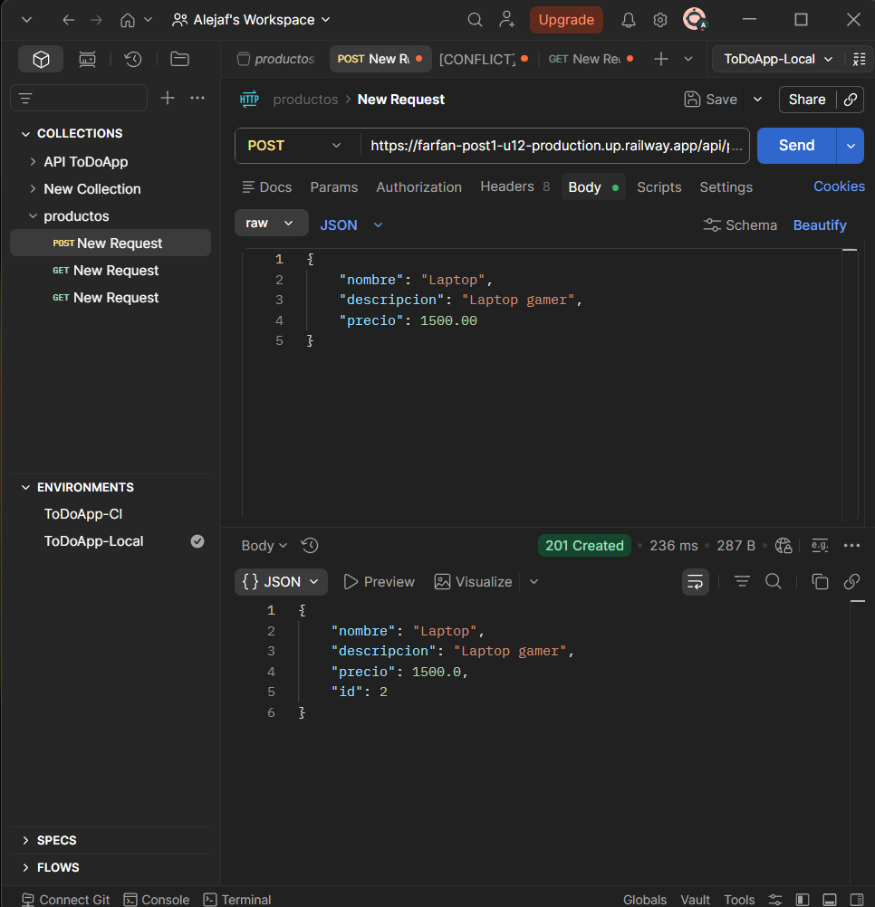
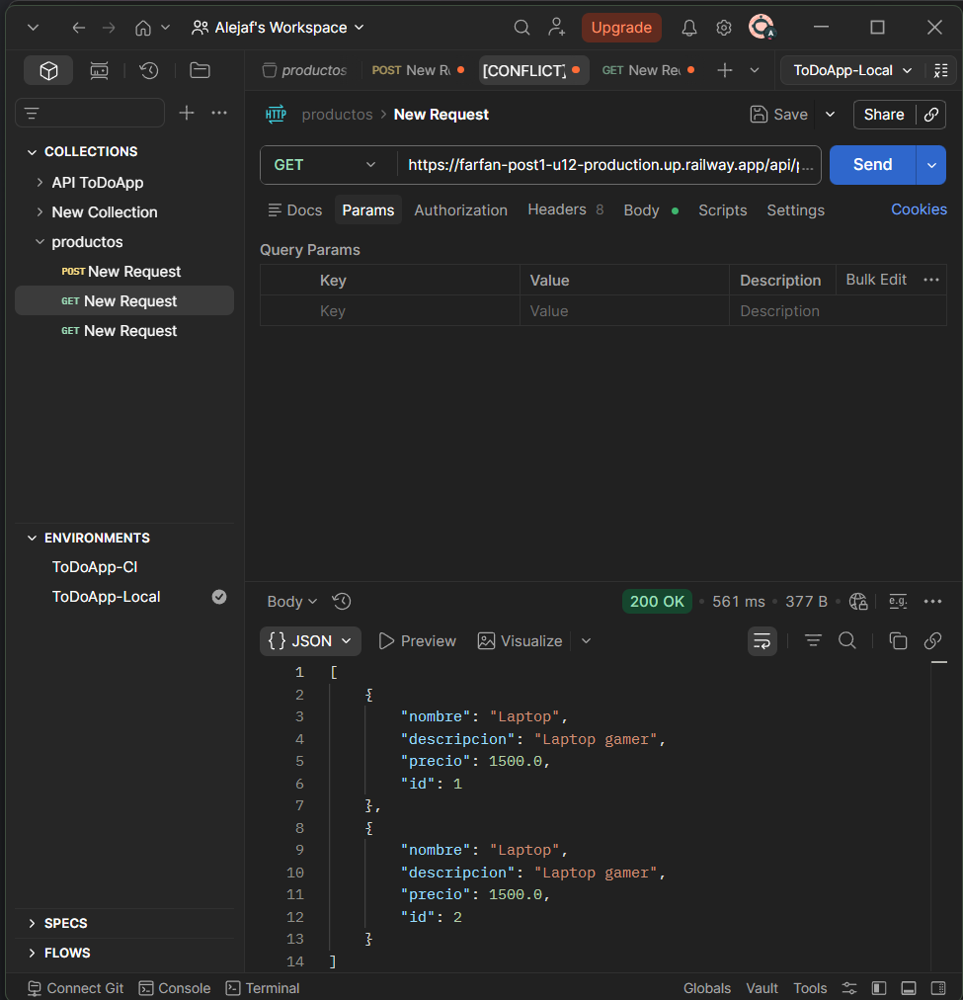
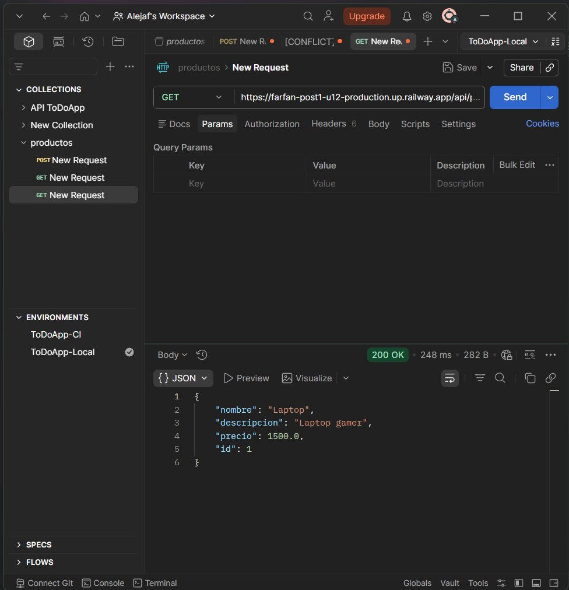
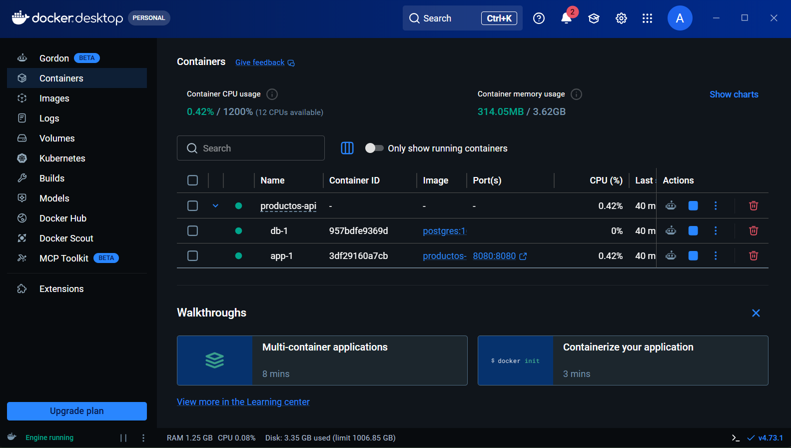
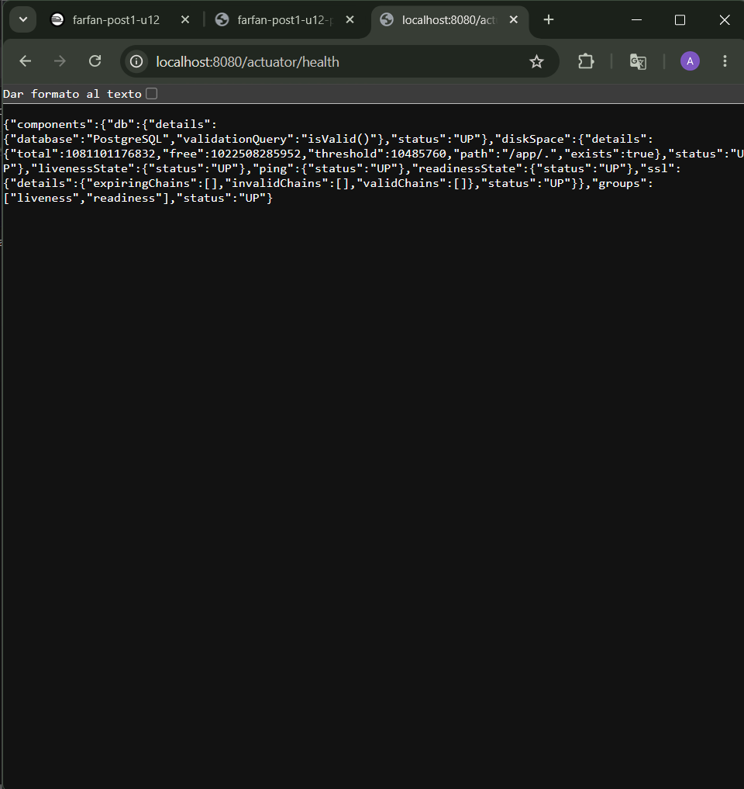

# Post-Contenido 1 Unidad 12

API REST de productos construida con Spring Boot, contenedorizada con Docker
mediante un Dockerfile multi-stage y desplegada en Railway con PostgreSQL.

## URL de la aplicación en Railway
https://farfan-post1-u12-production.up.railway.app

## Tecnologías utilizadas

- Java 21
- Spring Boot 3.4
- Spring Data JPA
- PostgreSQL 16
- Docker (multi-stage build)
- Docker Compose
- Railway (plataforma de despliegue)
- Maven

## Endpoints disponibles

| Método | Endpoint               | Descripción                  |
|--------|------------------------|------------------------------|
| GET    | /api/productos         | Listar todos los productos   |
| GET    | /api/productos/{id}    | Buscar producto por ID       |
| POST   | /api/productos         | Crear un nuevo producto      |
| PUT    | /api/productos/{id}    | Actualizar un producto       |
| DELETE | /api/productos/{id}    | Eliminar un producto         |
| GET    | /actuator/health       | Estado de la aplicación      |

## Variables de entorno requeridas

| Variable               | Descripción                              | Ejemplo                              |
|------------------------|------------------------------------------|--------------------------------------|
| SPRING_PROFILES_ACTIVE | Perfil activo de Spring Boot             | prod                                 |
| DATABASE_URL           | URL JDBC completa de PostgreSQL          | jdbc:postgresql://host:5432/appdb    |
| DB_USER                | Usuario de la base de datos              | appuser                              |
| DB_PASS                | Contraseña de la base de datos           | apppass                              |

## Ejecutar localmente con Docker

### Requisitos previos
- Docker Desktop instalado y corriendo
- Git instalado

### Pasos para ejecutar

**1. Clonar el repositorio:**
```bash
git clone https://github.com/Alejafarfan/farfan-post1-u12.git
cd farfan-post1-u12
```

**2. Construir y levantar los servicios:**
```bash
docker compose up -d --build
```
Esto levanta dos contenedores:
- `productos-api-app-1` — la aplicación Spring Boot en el puerto 8080
- `productos-api-db-1` — PostgreSQL 16

**3. Verificar que la aplicación está corriendo:**
```bash
docker compose ps
```

**4. Probar el health check:**
```
http://localhost:8080/actuator/health
```
Respuesta esperada:
```json
{"status":"UP"}
```

**5. Probar los endpoints:**
```
GET  http://localhost:8080/api/productos
POST http://localhost:8080/api/productos
```

**6. Detener la aplicación:**
```bash
docker compose down
```

**7. Detener y eliminar volúmenes (borra los datos):**
```bash
docker compose down -v
```

## 🏗️ Estructura del proyecto

```
productos-api/
├── src/
│   └── main/
│       ├── java/com/universidad/productosapi/
│       │   ├── controller/ProductoController.java
│       │   ├── model/Producto.java
│       │   └── repository/ProductoRepository.java
│       └── resources/
│           ├── application.properties
│           └── application-prod.properties
├── Dockerfile
├── docker-compose.yml
├── .dockerignore
└── pom.xml
```

## 🔧 Configuración de perfiles

### Perfil por defecto (desarrollo local con Docker)
Archivo: `src/main/resources/application.properties`
- Conecta a PostgreSQL via variables de entorno
- JPA en modo `update` (crea tablas automáticamente)
- SQL visible en consola

### Perfil de producción (Railway)
Archivo: `src/main/resources/application-prod.properties`
- Variables de entorno provistas por Railway
- SQL oculto
- Logs reducidos al mínimo

## Despliegue en Railway

### Configuración de variables en Railway

En el panel de Railway, servicio `farfan-post1-u12`, pestaña Variables:

```
SPRING_PROFILES_ACTIVE=prod
DATABASE_URL=jdbc:postgresql://${{Postgres.PGHOST}}:${{Postgres.PGPORT}}/${{Postgres.PGDATABASE}}
DB_USER=${{Postgres.PGUSER}}
DB_PASS=${{Postgres.PGPASSWORD}}
```

### Pasos del despliegue
1. Conectar el repositorio de GitHub a Railway
2. Railway detecta el Dockerfile automáticamente
3. Agregar servicio PostgreSQL desde el panel
4. Configurar las variables de entorno
5. Generar dominio público en Settings → Networking

## Dockerfile multi-stage

El Dockerfile usa dos etapas:
- **Etapa builder:** imagen JDK + Maven para compilar el proyecto
- **Etapa producción:** imagen JRE liviana con usuario no root para ejecutar

Esto reduce el tamaño de la imagen final y elimina herramientas de desarrollo innecesarias en producción.

## Figura 1. Panel de Railway — servicios app y PostgreSQL activos
[]

## Figura 2. Variables de entorno configuradas en Railway
[]

## Figura 3. Deployment exitoso en Railway
[]

## Figura 4. Health check en producción — Railway
[]
https://farfan-post1-u12-production.up.railway.app/actuator/health

## Figura 5. Endpoint POST /api/productos — creación de producto (Railway)
[]

## Figura 6. Endpoint GET /api/productos — listado de productos (Railway)
[]

## Figura 7. Endpoint GET /api/productos/1 — búsqueda por ID (Railway)
[]

## Figura 8. Contenedores locales en estado Up/healthy — Docker Compose
[]

## Figura 9. Health check en entorno local — localhost:8080
[]
